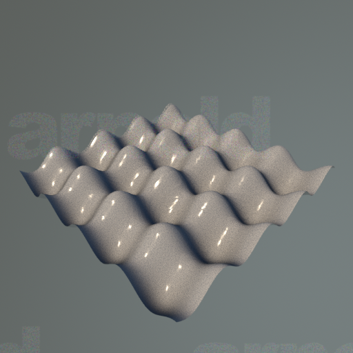

# arnold_plugins
Some Arnold plugins made mostly for fun.

## Procedurals

### so_expr_implicit

*This is actually a shape, but we list it as a procedural.*

Renders as an implicit surface defined by a simple expression. The example shows a bumpy planar surface generated by the expression `"0.1*cos(10*x) + 0.1*sin(10*z) - y"`.

Parameters are the same as `implicit`, but `field` should be set to its default: `"field"`. `min` and `max` must also be set and defines the domain.

The expression supports three variables, `x`, `y` and `z`, which are world space coordinates.